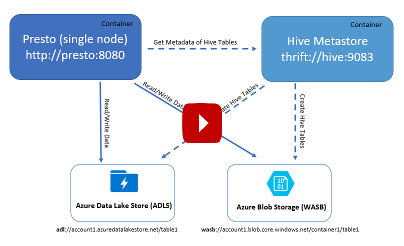

# Example of a single node Presto with Azure Data Lake Store (ADLS) and Azure Blob Storage (WASB)

Click to watch video
[](https://youtu.be/hflThIJdkrI)

## Start local Hive metastore and Presto containers

Clone this repo

```git clone https://github.com/arsenvlad/docker-presto-adls-wasb```

Run Hive and Presto containers using config specified in *env.conf.private*

```docker-compose up --build```

In a separate terminal window, list currently running containers

```docker ps```

## Connect to Hive bash

In a separate terminal window, open interactive tty bash on the Hive container

```docker exec -it dockerprestoadlswasb_hive_1 bash```

In the Hive container bash session, open Hive CLI pointing to itself as an external metastore. If you get an error saying "Name node is in safe mode", wait for a few minutes and try again.

```hive --hiveconf hive.metastore.uris=thrift://localhost:9083```

Create table using Azure Storage Blobs (change the storage account name and container name to yours)

```create table wasbtable1 (id int, name varchar(255)) row format delimited fields terminated by ',' stored as textfile location 'wasb://test-hive@avdatarepo1.blob.core.windows.net/wasbtable1';```

Create table using Azure Data Lake Store (change the ADLS account name to yours)

```create table adltable1 (id int, name varchar(255)) row format delimited fields terminated by ',' stored as textfile location 'adl://avdatalake1.azuredatalakestore.net/adltable1';```

Confirm you can see the tables
```show tables;```

## Connect to Presto bash

In a separate terminal window, open interactive tty bash on the Presto container

```docker exec -it dockerprestoadlswasb_presto_1 bash```

Presto is configured with a single node with Hive connector as described in [/etc/motd](files/motd.txt)

Use Presto CLI to connect to the running Presto server

```/opt/presto/presto --server http://localhost:8080```

List shemas in Hive catalog

```show schemas from hive;```

List tables in the Hive default catalog

```show tables from hive.default;```

Insert data into the tables

```
insert into hive.default.wasbtable1 (id, name) values (1,'1');
insert into hive.default.wasbtable1 (id, name) select id, name from hive.default.wasbtable1 union all select id, name from hive.default.wasbtable1 union all select id, name from hive.default.wasbtable1;

insert into hive.default.adltable1 (id, name) values (1,'1');
insert into hive.default.adltable1 (id, name) select id, name from hive.default.adltable1 union all select id, name from hive.default.adltable1 union all select id, name from hive.default.adltable1;
```

Select from the table

```select * from hive.default.adltable1;```

## When using with HDInsight

NOTE: To access Azure HDInsight Hive Thrift Service your Docker host VM must be within the same network.

To find the URLs of the HDInsight Hive Thrift Service (i.e. hive.metastore.uri), SSH into the HDInsight cluster and run this grep command:

```echo $(grep -n1 "hive.metastore.uri" /etc/hive/conf/hive-site.xml | grep -o "<value>.*/value>" | sed 's:<value>::g' | sed 's:</value>::g')```

## Presto with Azure Data Services

See [azure-data-services.md](azure-data-services.md) for an example showing how to configure Presto connectors to Azure Data Services to query and join data from Azure CosmosDB (using MongoDB API), Azure SQL Database, Azure MySQL, Azure PostgreSQL and store the joined results in Azure Blob Storage.

[](https://youtu.be/XDfCK6Ejz-A)

